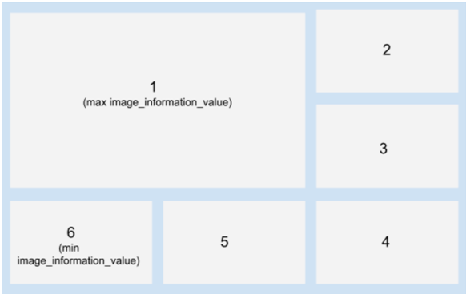

# collage-maker
The function **collageCreate** (address_folder_of_extracted_frames) calls **sortFrames** and makeCollage and then displays and returns the collage finally formed.

**sortFrames** takes the 6 frames as input and arranges them in an order based on their color and edge information. The Brightness, Edges detected and the Contrast/Color Variation in the image are considered as follows :

## Brightness :
The mean of intensity values are calculated for each of R,G,B and an average for the 3 colors is taken. 

## Edges :
Canny Edge detection is applied to obtain an edge map. In the edge map (1 bit image), a measure of the number of white pixels is taken. (fraction: no. of white pixels/ total pixels)

## Contrast :
The contrast for the image has been calculated as the standard deviation of the pixel intensities for each color R,B,G (which are then averaged). 

Sorting is done on the basis of **image_information_value** computed as a product of the above 3 parameters.

**makeCollage** is given the sorted frames as input and it creates a collage as described below :

An example outputs folder has been added along with two frame sets to run the code.
